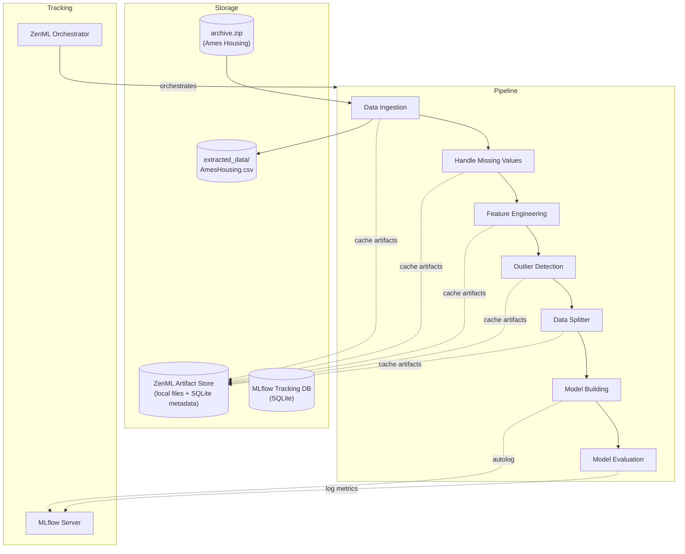
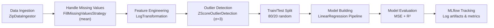
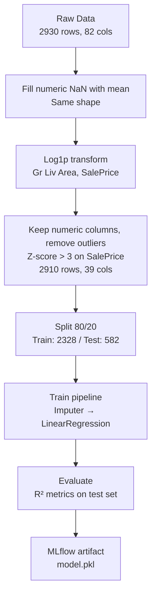

<p align="center">
  <a href="https://github.com/ShibilAhamed701212/Price-Predictor-System/actions/workflows/ci.yml"></a>
  
  
  
  
  
</p>

<h1 align="center">🏠 Price Predictor System</h1>

<p align="center">
  <strong>An end-to-end MLOps pipeline for residential property price prediction using Linear Regression, ZenML, and MLflow.</strong>
</p>

<p align="center">
  <em>Predicts house sale prices from the Ames Housing dataset with structured preprocessing, experiment tracking, and model deployment.</em>
</p>

---

## Overview

The Price Predictor System is a machine learning project that predicts residential property prices using the Ames Housing dataset. It implements a complete MLOps workflow — from data ingestion through model evaluation — orchestrated with ZenML pipelines and tracked with MLflow.

The project demonstrates production-grade software engineering patterns (Strategy, Factory, Template Method) applied to ML pipeline components, with clear separation between core logic (`src/`), pipeline steps (`steps/`), and orchestration (`pipelines/`).

## Features

- **Data Ingestion** — Automatic extraction and loading of ZIP-compressed CSV data
- **Missing Value Handling** — Configurable strategies: mean/median/mode imputation or row/column dropping
- **Feature Engineering** — Log transformation, standard scaling, min-max scaling, and one-hot encoding
- **Outlier Detection & Removal** — Z-score and IQR-based methods; the pipeline removes rows whose log `SalePrice` has |z| > 3
- **Train/Test Splitting** — Reproducible 80/20 random split (`random_state=42`)
- **Linear Regression Model** — Scikit-learn pipeline with preprocessing (`SimpleImputer` for numeric columns; a `OneHotEncoder` branch exists but receives no columns, see [Known Limitations](#known-limitations))
- **Model Evaluation** — MSE and R-squared on the log-transformed target
- **Experiment Tracking** — MLflow autologging for metrics, parameters, and model artifacts
- **Pipeline Orchestration** — Modular 7-step ZenML pipeline with step isolation (caching is disabled for the training and evaluation steps)
- **Local Model Serving** — Continuous deployment pipeline that serves the model with an MLflow REST server and runs a batch inference pipeline against it
- **Automated Checks** — Unit tests for the core `src/` logic and pipeline steps, plus `ruff` linting, run in GitHub Actions
- **Interactive Walkthrough** — Step-by-step pipeline runner with progress pauses for visualization
- **Design Pattern Documentation** — Educational examples of Strategy, Factory, and Template Method patterns

## Tech Stack

### Machine Learning
| Library | Purpose |
|---|---|
| **scikit-learn** ≥ 1.4, < 1.9 | Linear regression, preprocessing, train/test split, metrics |
| **NumPy** | Numerical operations, log transformations |
| **Pandas** ≥ 2.1 (3.x supported) | DataFrame manipulation, data inspection |
| **SciPy** | Z-scores in the interactive walkthrough (installed with scikit-learn) |

### Data Processing
| Library | Purpose |
|---|---|
| **Statsmodels** | Listed for EDA; not imported by the pipeline |
| **Matplotlib** / **Seaborn** | Visualization and EDA |

### MLOps
| Tool | Purpose |
|---|---|
| **ZenML** (`zenml[local]`) | ML pipeline orchestration, artifact management, model control plane |
| **MLflow** | Experiment tracking (autologging) and local model server |
| **MLflow Model Deployer** | Local REST API serving via ZenML integration |

### Development Tools
| Tool | Purpose |
|---|---|
| **Python** 3.10+ | Runtime (CI uses 3.12; verified locally on 3.11) |
| **Click** 8.1 | CLI for `run_pipeline.py` / `run_deployment.py` |
| **Rich** | Terminal formatting (deployment pipeline) |
| **pytest** / **ruff** | Unit tests and linting (CI) |

## Architecture

### System Architecture



### ML Pipeline Workflow



### Data Flow



## Project Structure

```
Price-Predictor-System/
├── run_pipeline.py              # Pipeline entry point
├── run_deployment.py            # Deployment pipeline entry point
├── predict.py                   # Local model prediction script
├── sample_predict.py            # REST API prediction client
├── run_step_by_step.py          # Interactive step-by-step pipeline
├── run_screenshots.bat          # Batch launcher for step-by-step
├── requirements.txt             # Python dependencies
├── config.yaml                  # ZenML run configuration (not loaded by the scripts)
├── ruff.toml                    # Lint configuration
├── .github/workflows/ci.yml     # Lint + unit tests
├── .gitignore
├── LICENSE                      # MIT License
│
├── data/
│   └── archive.zip              # Ames Housing dataset (ZIP)
│
├── extracted_data/              # Created at runtime by data ingestion (git-ignored)
│
├── src/                         # Core ML logic (Strategy/Factory patterns)
│   ├── ingest_data.py
│   ├── handle_missing_values.py
│   ├── feature_engineering.py
│   ├── outlier_detection.py
│   ├── data_splitter.py
│   ├── model_building.py
│   └── model_evaluator.py
│
├── steps/                       # ZenML pipeline step wrappers
│   ├── data_ingestion_step.py
│   ├── handle_missing_values_step.py
│   ├── feature_engineering_step.py
│   ├── outlier_detection_step.py
│   ├── data_splitter_step.py
│   ├── model_building_step.py
│   ├── model_evaluator_step.py
│   ├── dynamic_importer.py
│   ├── model_loader.py
│   ├── prediction_service_loader.py
│   └── predictor.py
│
├── pipelines/                   # Pipeline orchestration
│   ├── training_pipeline.py     # 7-step training pipeline
│   └── deployment_pipeline.py   # Continuous deployment + inference
│
├── analysis/                    # Exploratory Data Analysis
│   ├── EDA.ipynb
│   └── analyze_src/             # Analysis modules (Strategy/Template patterns)
│       ├── basic_data_inspection.py
│       ├── missing_values_analysis.py
│       ├── univariate_analysis.py
│       ├── bivariate_analysis.py
│       └── multivariate_analysis.py
│
├── explanations/                # Design pattern educational examples
│   ├── factory_design_patter.py
│   ├── strategy_design_pattern.py
│   └── template_design_pattern.py
│
├── tests/                       # pytest unit tests
│
├── mlruns/                      # Sample MLflow run artifacts committed earlier
└── docs/                        # Documentation
    ├── ARCHITECTURE.md
    ├── TECHNICAL.md
    └── MLOPS.md
```

## Installation

### Prerequisites

- Python 3.10+
- Git
- Linux / macOS (training, serving and inference verified on Linux) or Windows (training and `predict.py`; MLflow serving is not supported on Windows)

### Setup

```bash
# Clone the repository
git clone https://github.com/ShibilAhamed701212/Price-Predictor-System.git
cd Price-Predictor-System

# Create and activate virtual environment
python -m venv venv
# Windows:
.\venv\Scripts\activate
# macOS/Linux:
# source venv/bin/activate

# Install dependencies (includes zenml[local], needed for the local ZenML store)
pip install -r requirements.txt

# Initialise ZenML and install its MLflow integration
zenml init
zenml integration install mlflow -y
```

### Configure ZenML Stack

```bash
# Register MLflow experiment tracker
zenml experiment-tracker register mlflow_tracker --flavor=mlflow

# Register MLflow model deployer
zenml model-deployer register mlflow_deployer --flavor=mlflow

# Create and set stack
zenml stack register mlflow_stack \
    -a default \
    -o default \
    -e mlflow_tracker \
    -d mlflow_deployer
zenml stack set mlflow_stack
```

The training step needs an experiment tracker in the active stack; on the default stack it fails with a message pointing back to this section.

## Usage

### Run the Training Pipeline

```bash
python run_pipeline.py
```

This executes all 7 steps in sequence:
1. **Data Ingestion** — Extracts and loads the Ames Housing dataset
2. **Handle Missing Values** — Fills numeric missing values with column mean
3. **Feature Engineering** — Log-transforms `Gr Liv Area` and `SalePrice`
4. **Outlier Detection** — Keeps the numeric columns and removes rows whose `SalePrice` Z-score exceeds 3 (20 rows)
5. **Data Splitter** — Splits into 80% training / 20% testing
6. **Model Building** — Trains LinearRegression with scikit-learn pipeline
7. **Model Evaluation** — Computes MSE and R-squared metrics

### View Experiment Results

```bash
mlflow ui --backend-store-uri '<tracking-uri>'
```

The tracking URI is printed at the end of each pipeline run.

### Interactive Walkthrough

```bash
python run_step_by_step.py
```

Pauses after each step for detailed inspection and screenshots.

### Test a Prediction (Local Artifact)

```bash
python predict.py                              # latest sklearn_pipeline artifact from ZenML
python predict.py --model-path path/to/artifact.pkl   # or a pickled pipeline file (also: MODEL_PATH env var)
```

The script applies the same `log1p` transform to `Gr Liv Area` that training used and converts the log-price prediction back to dollars. Only load pickle files you created yourself.

### Test Predictions (Deployment Server)

```bash
python run_deployment.py
```

This trains the model, deploys it to a local MLflow server at `http://127.0.0.1:8000/invocations` (as a background daemon) and runs the inference pipeline against it. Then:

```bash
python sample_predict.py          # sends one house to the REST API and prints the price in dollars
python run_deployment.py --stop-service
```

> **Note:** MLflow daemon deployment is not supported on Windows.

## Results

Numbers below come from a real run of `python run_pipeline.py` on 2026-10-04 (Linux, Python 3.11, scikit-learn 1.8, pandas 3.0, ZenML 0.96, MLflow 3.16). The split is seeded, so repeated runs give the same values.

### Model Performance (log-transformed `SalePrice`)

| Metric | Value |
|---|---|
| **Test R²** | 0.8568 |
| **Test MSE** | 0.0199 |
| **Training R²** (MLflow autolog) | 0.8939 |
| **Training RMSE** (MLflow autolog) | 0.1277 |
| **Training MAE** (MLflow autolog) | 0.0901 |
| Rows after outlier removal | 2910 (train 2328 / test 582) |

### Example Output

```text
$ python run_pipeline.py
...
Removed 20 outlier rows based on 'SalePrice'.
Model Evaluation Metrics: {'Mean Squared Error': 0.019891652202700456, 'R-Squared': 0.8567861675345625}
Pipeline run has finished in 8.703s.

$ python predict.py
Predicted SalePrice: $221,544.47

$ python run_deployment.py && python sample_predict.py
...
The MLflow prediction server is running locally as a daemon process and accepts
inference requests at:
    http://127.0.0.1:8000/invocations
Predicted SalePrice: $182,937.07
```

### Screenshots

The project has no graphical interface; it is driven from the command line. The MLflow UI (`mlflow ui --backend-store-uri <tracking-uri>`) can be used to browse runs. No screenshots are committed yet.

## Testing

```bash
pip install pytest ruff
ruff check .
pytest -q
```

The tests in `tests/` cover data ingestion, missing-value strategies, feature engineering, outlier detection, splitting, model building/evaluation and the outlier-detection step. They use small in-memory frames plus the bundled `data/archive.zip`, and do not need an MLflow server. GitHub Actions runs the same lint and tests on every push and pull request.

## Fixes From the 2026-10 Audit

| Problem | Fix |
|---|---|
| Outlier step removed rows with a Z-score > 3 in **any** numeric column (30% of the data), so every house with a basement half bath was dropped and such homes were priced at ~$1,400 | Outliers are now detected on the `column_name` passed to the step (`SalePrice`), as documented |
| `sample_predict.py` and the inference `predictor` step sent raw `Gr Liv Area` and returned log-scale numbers (e.g. `280.46`) | Both apply `log1p` to `Gr Liv Area` and `expm1` to the prediction |
| `predict.py` loaded a hard-coded `C:\Users\...` pickle path | Loads the latest ZenML artifact, or `--model-path` / `MODEL_PATH` |
| `OneHotEncoding` used `OneHotEncoder(sparse=False)`, a `TypeError` on scikit-learn ≥ 1.4 | Uses `sparse_output=False` and keeps the original row index |
| `FillMissingValuesStrategy("mode")` used chained `fillna(inplace=True)`, which fills nothing under pandas copy-on-write | Assigns the filled column back; skips all-NaN columns |
| `DropMissingValuesStrategy` passed `thresh=None`, which drops every row on pandas 3 | Only passes `thresh` when set |
| Importing the training step on a stack without an experiment tracker crashed with `'NoneType' object has no attribute 'name'` | Clear error message from the step instead |
| `run_deployment.py` raised `IndexError` when no service was found | Checks for an empty result |
| README stack commands used `--type=mlflow` (rejected by ZenML) and `zenml` lacked the `[local]` extra needed for the local store | Commands use `--flavor=mlflow`; requirements install `zenml[local]` |

## Known Limitations

- **Categorical features are not used.** The outlier step keeps only numeric columns, so the model's one-hot branch receives no columns (`Categorical columns: []` in the logs).
- **Identifier columns are features.** `Order` and `PID` are fed to the regression.
- **Preprocessing before the split.** Mean imputation and outlier statistics are computed on the full dataset before the train/test split, so the test score is slightly optimistic.
- **Log-scale metrics.** MSE and R² are on `log1p(SalePrice)`, not dollars.
- **Single model, single split.** No cross-validation or hyperparameter tuning.
- **Windows serving.** MLflow's daemon server does not run on Windows.
- `config.yaml` (owner and license fields) is not loaded by any script.

## MLflow Integration

Experiment tracking is fully integrated via MLflow's scikit-learn autologging:

- **Automatic Logging:** Every model training step captures metrics (MSE, MAE, R², RMSE), parameters, and the serialized model
- **Run History:** Runs are recorded under an MLflow experiment named after the ZenML pipeline (`ml_pipeline`, `continuous_deployment_pipeline`)
- **Model Artifacts:** Each run stores the complete `Pipeline` object as `model.pkl` in MLflow's artifact store
- **Local Dashboard:** Launch the UI with `mlflow ui` for run comparison, metric visualization, and artifact download

The tracking URI is an SQLite database inside ZenML's local store; `run_pipeline.py` prints it at the end of each run.

## Future Improvements

- [ ] **Hyperparameter Tuning** — GridSearchCV or Optuna for LinearRegression and alternative models
- [ ] **Additional Models** — Random Forest, XGBoost, Gradient Boosting
- [ ] **Feature Selection** — Recursive feature elimination, PCA dimensionality reduction
- [ ] **Cross-Validation** — k-fold validation for more robust evaluation
- [ ] **Data Versioning** — DVC or LakeFS integration for dataset version control
- [ ] **Categorical Features** — Feed one-hot encoded categorical columns to the model
- [ ] **Containerization** — Docker packaging for reproducible execution
- [ ] **Cloud Deployment** — MLflow serving on AWS SageMaker, Azure ML, or GCP Vertex AI
- [ ] **Feature Store** — Feast or Tecton for feature versioning and serving
- [ ] **Monitoring** — Model drift detection with Evidently or WhyLabs
- [ ] **Web Interface** — Streamlit or FastAPI frontend for interactive predictions
- [ ] **Windows Daemon Support** — Alternative deployment approach for Windows environments

## Contributing

Contributions are welcome! Please follow these steps:

1. Fork the repository
2. Create a feature branch (`git checkout -b feature/your-feature`)
3. Commit your changes (`git commit -m 'Add some feature'`)
4. Push to the branch (`git push origin feature/your-feature`)
5. Open a Pull Request

## License

Distributed under the MIT License. See `LICENSE` for more information.

---

<p align="center">
  Built with Python, ZenML, and MLflow
</p>
