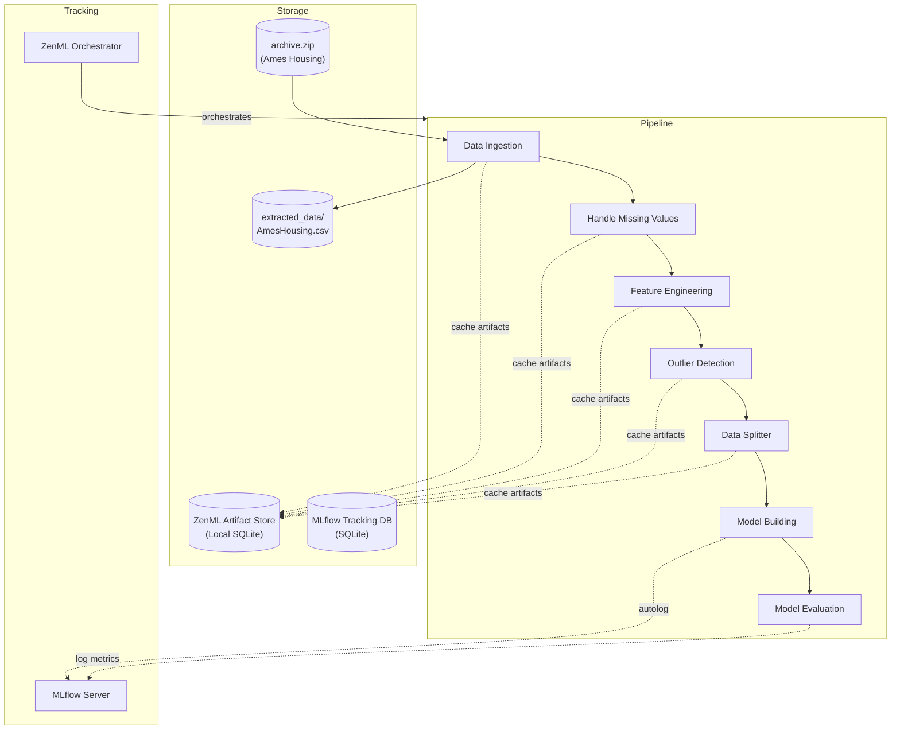
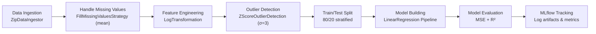
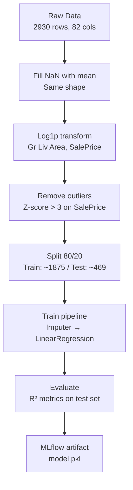

<p align="center">
  
  
  
  
  
</p>

<h1 align="center">🏠 Price Predictor System</h1>

<p align="center">
  <strong>An end-to-end MLOps pipeline for residential property price prediction using Linear Regression, ZenML, and MLflow.</strong>
</p>

<p align="center">
  <em>Predicts house sale prices from the Ames Housing dataset with structured preprocessing, experiment tracking, and model deployment.</em>
</p>

---

## Overview

The Price Predictor System is a machine learning project that predicts residential property prices using the Ames Housing dataset. It implements a complete MLOps workflow — from data ingestion through model evaluation — orchestrated with ZenML pipelines and tracked with MLflow.

The project demonstrates production-grade software engineering patterns (Strategy, Factory, Template Method) applied to ML pipeline components, with clear separation between core logic (`src/`), pipeline steps (`steps/`), and orchestration (`pipelines/`).

## Features

- **Data Ingestion** — Automatic extraction and loading of ZIP-compressed CSV data
- **Missing Value Handling** — Configurable strategies: mean/median/mode imputation or row/column dropping
- **Feature Engineering** — Log transformation, standard scaling, min-max scaling, and one-hot encoding
- **Outlier Detection & Removal** — Z-score and IQR-based methods with configurable thresholds
- **Train/Test Splitting** — Reproducible 80/20 stratified split
- **Linear Regression Model** — Scikit-learn pipeline with preprocessing (`SimpleImputer` + `OneHotEncoder`)
- **Model Evaluation** — MSE and R-squared metrics with proper inverse-transformed scale interpretation
- **Experiment Tracking** — MLflow autologging for metrics, parameters, and model artifacts
- **Pipeline Orchestration** — Modular 7-step ZenML pipeline with caching and step isolation
- **Interactive Walkthrough** — Step-by-step pipeline runner with progress pauses for visualization
- **Design Pattern Documentation** — Educational examples of Strategy, Factory, and Template Method patterns

## Tech Stack

### Machine Learning
| Library | Purpose |
|---|---|
| **scikit-learn** 1.6 | Linear regression, preprocessing, train/test split, metrics |
| **NumPy** 2.x | Numerical operations, log transformations |
| **Pandas** 2.x | DataFrame manipulation, data inspection |
| **SciPy** | Statistical functions for Z-score outlier detection |

### Data Processing
| Library | Purpose |
|---|---|
| **Statsmodels** 0.14 | Optional statistical analysis |
| **Matplotlib** / **Seaborn** | Visualization and EDA |

### MLOps
| Tool | Purpose |
|---|---|
| **ZenML** 0.95 | ML pipeline orchestration, step caching, artifact management |
| **MLflow** 3.14 | Experiment tracking, model registry, local deployment server |
| **MLflow Model Deployer** | Local REST API serving via ZenML integration |

### Development Tools
| Tool | Purpose |
|---|---|
| **Python** 3.12 | Runtime |
| **Click** 8.1 | CLI interface for pipeline execution |
| **Rich** | Terminal formatting (deployment pipeline) |
| **Git** | Version control |

## Architecture

### System Architecture



### ML Pipeline Workflow



### Data Flow



## Project Structure

```
Price-Predictor-System/
├── run_pipeline.py              # Pipeline entry point
├── run_deployment.py            # Deployment pipeline entry point
├── predict.py                   # Local model prediction script
├── sample_predict.py            # REST API prediction client
├── run_step_by_step.py          # Interactive step-by-step pipeline
├── run_screenshots.bat          # Batch launcher for step-by-step
├── requirements.txt             # Python dependencies
├── config.yaml                  # ZenML project configuration
├── .gitignore
├── LICENSE                      # MIT License
│
├── data/
│   └── archive.zip              # Ames Housing dataset (ZIP)
│
├── extracted_data/
│   └── AmesHousing.csv          # Extracted dataset
│
├── src/                         # Core ML logic (Strategy/Factory patterns)
│   ├── ingest_data.py
│   ├── handle_missing_values.py
│   ├── feature_engineering.py
│   ├── outlier_detection.py
│   ├── data_splitter.py
│   ├── model_building.py
│   └── model_evaluator.py
│
├── steps/                       # ZenML pipeline step wrappers
│   ├── data_ingestion_step.py
│   ├── handle_missing_values_step.py
│   ├── feature_engineering_step.py
│   ├── outlier_detection_step.py
│   ├── data_splitter_step.py
│   ├── model_building_step.py
│   ├── model_evaluator_step.py
│   ├── dynamic_importer.py
│   ├── model_loader.py
│   ├── prediction_service_loader.py
│   └── predictor.py
│
├── pipelines/                   # Pipeline orchestration
│   ├── training_pipeline.py     # 7-step training pipeline
│   └── deployment_pipeline.py   # Continuous deployment + inference
│
├── analysis/                    # Exploratory Data Analysis
│   ├── EDA.ipynb
│   └── analyze_src/             # Analysis modules (Strategy/Template patterns)
│       ├── basic_data_inspection.py
│       ├── missing_values_analysis.py
│       ├── univariate_analysis.py
│       ├── bivariate_analysis.py
│       └── multivariate_analysis.py
│
├── explanations/                # Design pattern educational examples
│   ├── factory_design_patter.py
│   ├── strategy_design_pattern.py
│   └── template_design_pattern.py
│
├── mlruns/                      # MLflow experiment artifacts
└── docs/                        # Documentation
    ├── ARCHITECTURE.md
    ├── TECHNICAL.md
    └── MLOPS.md
```

## Installation

### Prerequisites

- Python 3.12+
- Git
- Windows (tested) / macOS / Linux

### Setup

```bash
# Clone the repository
git clone https://github.com/ShibilAhamed701212/Price-Predictor-System.git
cd Price-Predictor-System

# Create and activate virtual environment
python -m venv venv
# Windows:
.\venv\Scripts\activate
# macOS/Linux:
# source venv/bin/activate

# Install dependencies
pip install -r requirements.txt

# Install ZenML integrations
zenml init
zenml integration install mlflow -y
```

### Configure ZenML Stack

```bash
# Register MLflow experiment tracker
zenml experiment-tracker register mlflow_tracker --type=mlflow

# Register MLflow model deployer
zenml model-deployer register mlflow_deployer --type=mlflow

# Create and set stack
zenml stack register mlflow_stack \
    -a default \
    -o default \
    -e mlflow_tracker \
    -d mlflow_deployer
zenml stack set mlflow_stack
```

## Usage

### Run the Training Pipeline

```bash
python run_pipeline.py
```

This executes all 7 steps in sequence:
1. **Data Ingestion** — Extracts and loads the Ames Housing dataset
2. **Handle Missing Values** — Fills numeric missing values with column mean
3. **Feature Engineering** — Log-transforms `Gr Liv Area` and `SalePrice`
4. **Outlier Detection** — Removes Z-score outliers on SalePrice (threshold: 3)
5. **Data Splitter** — Splits into 80% training / 20% testing
6. **Model Building** — Trains LinearRegression with scikit-learn pipeline
7. **Model Evaluation** — Computes MSE and R-squared metrics

### View Experiment Results

```bash
mlflow ui --backend-store-uri '<tracking-uri>'
```

The tracking URI is printed at the end of each pipeline run.

### Interactive Walkthrough

```bash
python run_step_by_step.py
```

Pauses after each step for detailed inspection and screenshots.

### Test a Prediction (Local Artifact)

```bash
python predict.py
```

Note: The model path in `predict.py` is absolute; update it to match your local ZenML artifact store path.

### Test Predictions (Deployment Server)

```bash
python run_deployment.py
```

Then in another terminal:

```bash
python sample_predict.py
```

> **Note:** MLflow daemon deployment is not supported on Windows. On Linux/macOS, this starts a local REST API at `http://127.0.0.1:8000`.

## Results

### Model Performance

| Metric | Value |
|---|---|
| **R-squared (R²)** | 0.7822 |
| **Mean Squared Error (MSE)** | 0.0306 |
| **Training R²** | 0.7715 |
| **Training RMSE** | 0.1776 |

*Metrics shown are from the latest pipeline run using log-transformed target variable.*

### Sample Prediction

```
Input: 1,710 sq ft, 3 beds, 2 baths, built 2003
Output: $211,982.21
```

### Screenshots

<!-- TODO: Add pipeline execution screenshots -->
<!--
- [ ] Pipeline run terminal output
- [ ] MLflow experiment comparison view
- [ ] MLflow run details (metrics, params, artifacts)
- [ ] Interactive walkthrough steps
-->

## MLflow Integration

Experiment tracking is fully integrated via MLflow's scikit-learn autologging:

- **Automatic Logging:** Every model training step captures metrics (MSE, MAE, R², RMSE), parameters, and the serialized model
- **Run History:** All pipeline executions are recorded under the Default experiment, accessible via the MLflow UI
- **Model Artifacts:** Each run stores the complete `Pipeline` object as `model.pkl` in MLflow's artifact store
- **Local Dashboard:** Launch the UI with `mlflow ui` for run comparison, metric visualization, and artifact download

The tracking URI is an SQLite database managed by ZenML's local artifact store, ensuring run persistence across sessions.

## Future Improvements

- [ ] **Hyperparameter Tuning** — GridSearchCV or Optuna for LinearRegression and alternative models
- [ ] **Additional Models** — Random Forest, XGBoost, Gradient Boosting
- [ ] **Feature Selection** — Recursive feature elimination, PCA dimensionality reduction
- [ ] **Cross-Validation** — k-fold validation for more robust evaluation
- [ ] **Data Versioning** — DVC or LakeFS integration for dataset version control
- [ ] **CI/CD Pipeline** — Automated testing and validation on pull requests
- [ ] **Containerization** — Docker packaging for reproducible execution
- [ ] **Cloud Deployment** — MLflow serving on AWS SageMaker, Azure ML, or GCP Vertex AI
- [ ] **Feature Store** — Feast or Tecton for feature versioning and serving
- [ ] **Monitoring** — Model drift detection with Evidently or WhyLabs
- [ ] **Web Interface** — Streamlit or FastAPI frontend for interactive predictions
- [ ] **Windows Daemon Support** — Alternative deployment approach for Windows environments

## Contributing

Contributions are welcome! Please follow these steps:

1. Fork the repository
2. Create a feature branch (`git checkout -b feature/your-feature`)
3. Commit your changes (`git commit -m 'Add some feature'`)
4. Push to the branch (`git push origin feature/your-feature`)
5. Open a Pull Request

## License

Distributed under the MIT License. See `LICENSE` for more information.

---

<p align="center">
  Built with Python, ZenML, and MLflow
</p>
