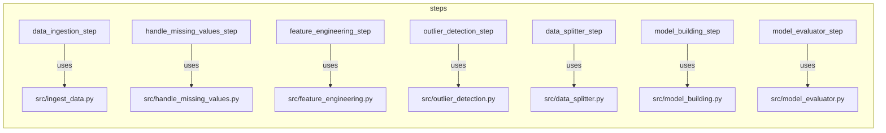
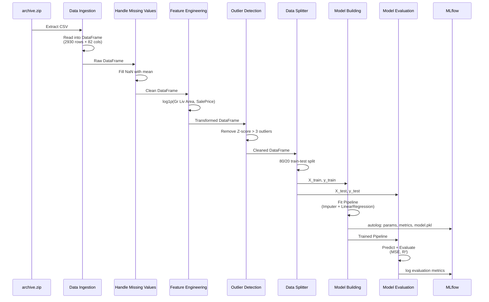
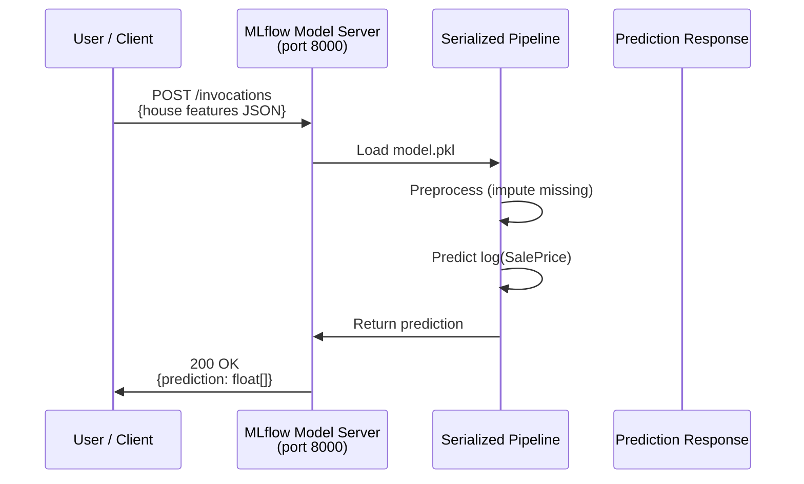
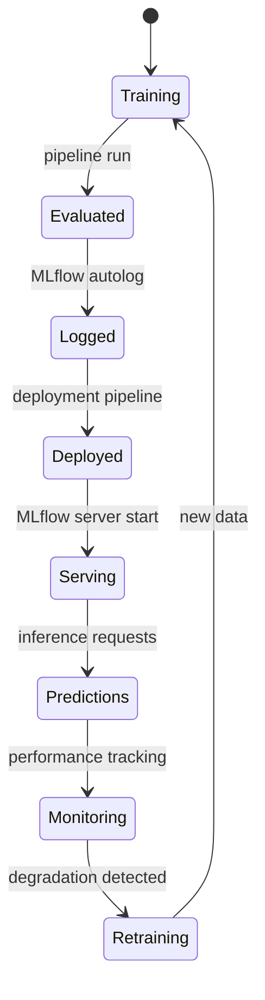

# Architecture Documentation

## High-Level Architecture

The Price Predictor System follows a **layered architecture** with strict separation of concerns:

```
┌──────────────────────────────────────────────────────────────┐
│                   Entry Points (CLI)                         │
│  run_pipeline.py  │  run_deployment.py  │  predict.py        │
└──────────────────────────┬───────────────────────────────────┘
                           │
┌──────────────────────────▼───────────────────────────────────┐
│                  Pipeline Orchestration                      │
│  pipelines/training_pipeline.py  │  pipelines/deployment.py  │
│  ZenML @pipeline decorators       │  Step composition        │
└──────────────────────────┬───────────────────────────────────┘
                           │
┌──────────────────────────▼───────────────────────────────────┐
│                   Pipeline Steps (ZenML)                     │
│  steps/*.py  │  @step decorators  │  Experiment tracker      │
│  Caching     │  Artifact config   │  MLflow autolog          │
└──────────────────────────┬───────────────────────────────────┘
                           │
┌──────────────────────────▼───────────────────────────────────┐
│              Core Domain Logic (src/)                        │
│  Strategy Pattern │ Factory Pattern │ ABC interfaces         │
│  Data processing  │ Model training  │ Evaluation             │
└──────────────────────────┬───────────────────────────────────┘
                           │
┌──────────────────────────▼───────────────────────────────────┐
│                    Data Storage                              │
│  data/archive.zip  │  ZenML Artifact Store  │  MLflow DB     │
└──────────────────────────────────────────────────────────────┘
```

## Component Responsibilities

### 1. Core Domain Logic (`src/`)

Each module implements an abstract base class defining a strategy interface, with concrete implementations and a context class.

| Module | Pattern | Strategy Interface | Concrete Strategies |
|---|---|---|---|
| `ingest_data.py` | Factory | `DataIngestor.ingest()` | `ZipDataIngestor` |
| `handle_missing_values.py` | Strategy | `MissingValueHandlingStrategy.handle()` | `DropMissingValuesStrategy`, `FillMissingValuesStrategy` |
| `feature_engineering.py` | Strategy | `FeatureEngineeringStrategy.apply_transformation()` | `LogTransformation`, `StandardScaling`, `MinMaxScaling`, `OneHotEncoding` |
| `outlier_detection.py` | Strategy | `OutlierDetectionStrategy.detect_outliers()` | `ZScoreOutlierDetection`, `IQROutlierDetection` |
| `data_splitter.py` | Strategy | `DataSplittingStrategy.split_data()` | `SimpleTrainTestSplitStrategy` |
| `model_building.py` | Strategy | `ModelBuildingStrategy.build_and_train_model()` | `LinearRegressionStrategy` |
| `model_evaluator.py` | Strategy | `ModelEvaluationStrategy.evaluate_model()` | `RegressionModelEvaluationStrategy` |

### 2. Pipeline Steps (`steps/`)

Thin wrappers that bridge ZenML step decorators with the core logic modules:



Steps handle cross-cutting concerns:
- **MLflow autologging** — Enabled in `model_building_step`
- **Artifact configuration** — Outputs tagged as `ModelArtifact` or `DataArtifact`
- **ZenML caching** — Controlled per-step via `enable_cache`
- **Experiment tracker binding** — Steps reference the active stack's experiment tracker

### 3. Pipeline Orchestration (`pipelines/`)

Defines the execution graph and data flow between steps.

**Training Pipeline** (`training_pipeline.py`):
- Composes 7 steps in sequence
- Registers the model under ZenML's `Model(name="prices_predictor")`
- Returns the trained pipeline object for downstream consumption

**Deployment Pipeline** (`deployment_pipeline.py`):
- Runs the full training pipeline
- Deploys the trained model via `mlflow_model_deployer_step`
- Provides an `inference_pipeline` for batch prediction against the deployed service

### 4. Entry Points (Root scripts)

| Script | Purpose |
|---|---|
| `run_pipeline.py` | Click CLI that executes `ml_pipeline()` and prints MLflow tracking URI |
| `run_deployment.py` | Click CLI for deployment pipeline with `--stop-service` flag |
| `predict.py` | Standalone inference script loading local ZenML artifact |
| `sample_predict.py` | REST API client for deployed MLflow model server |
| `run_step_by_step.py` | Educational walkthrough with manual step-by-step execution |
| `run_screenshots.bat` | Windows batch launcher for `run_step_by_step.py` |

## Data Flow

### Training Data Flow



### Inference Data Flow



## Model Lifecycle



**Current state:** The model passes through Training → Evaluated → Logged states. Deployment is available on Linux/macOS (MLflow daemon). Windows deployment is limited due to daemon restrictions.

## Experiment Tracking Workflow

```mermaid
flowchart LR
    RUN["Pipeline Run"] -->|@step decorator| MB["model_building_step"]
    MB -->|mlflow.sklearn.autolog()| ENABLE["Enable Autologging"]
    ENABLE --> FIT["pipeline.fit()"]
    FIT --> PARAMS["Log Parameters<br/>model type, columns"]
    FIT --> METRICS["Log Metrics<br/>MSE, R², MAE, RMSE"]
    FIT --> MODEL["Log Model Artifact<br/>model.pkl"]
    MODEL --> UI["MLflow UI<br/>http://127.0.0.1:5000"]

    subgraph "Per Run"
        PARAMS
        METRICS
        MODEL
    end
```

## Design Decisions

| Decision | Rationale |
|---|---|
| **Strategy Pattern** for ML components | Enables runtime algorithm switching, testability in isolation, and clean separation of algorithm from context |
| **ZenML over Airflow** | Lightweight pipeline orchestration with native MLflow integration, artifact versioning, and local execution without infrastructure |
| **Log transformation** of target variable | Stabilizes variance in sale prices (log-normal distribution → approximately normal), improving linear regression assumptions |
| **Z-score outlier detection** over IQR | Simpler threshold interpretation for normally distributed features; configurable sensitivity via threshold parameter |
| **SimpleImputer + OneHotEncoder pipeline** | Scikit-learn `Pipeline` ensures consistent preprocessing between training and inference, preventing data leakage |
| **SQLite tracking store** | Zero-configuration experiment persistence suitable for local development; upgradeable to PostgreSQL for production |
| **ZenML artifact lookup in predict.py** | Loads the latest `sklearn_pipeline` artifact by name; `--model-path` covers a standalone pickle |
